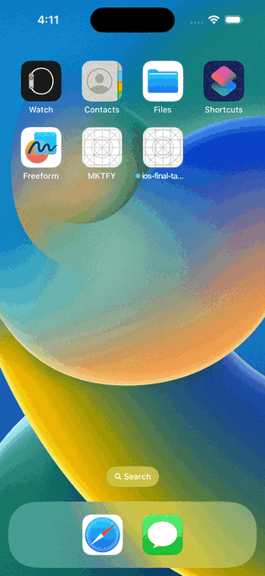
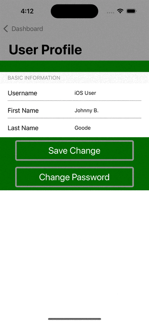
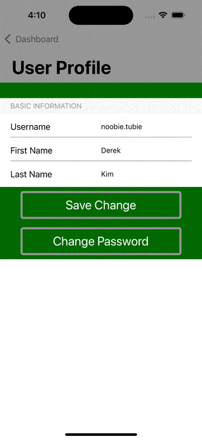
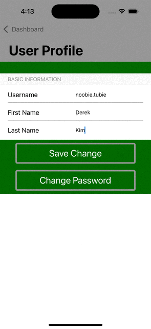
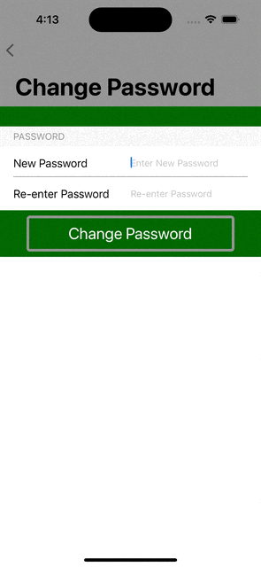

# iOS Final Take Home Code Challenge Submission - Derek Kim

## Link(s): 
Github Repository: https://github.com/treasure3210/iOS-final-take-home-challenge

## Demo:
### Get User

### Update User

### Change Password


### Error Cases:




### Autolayout Check with iPhone SE 3rd Generation:


## API Reference

#### Get User Profile Information

```http
  GET /profiles/me
```

| Parameter | Type     | Description                |
| :---- | :------- | :------------------------- |
| `msg` | `String` | *Returns Status Message* |
| `msg_code` | `Int` | *Returns Status Code* |
| `data:` | | **Consists of Three Fields** |
| `firstName` | `String` | *Returns First Name of the User* |
| `userName` | `String` | *Returns Username of the User* |
| `lastName` | `String` | *Returns Last Name of the User* |

#### Update User & Save Changes

```http
  POST /profiles/update
```

| Parameter | Type     | Description                |
| :---- | :------- | :------------------------- |
| `msg` | `String` | *Returns Status Message* |
| `msg_code` | `Int` | *Returns Status Code* |
| `data:` | | **Consists of Three Fields** |
| `firstName` | `String` | *Returns User's Saved First Name* |
| `userName` | `String` | *Returns User's Saved Username* |
| `lastName` | `String` | *Returns User's Saved Last Name* |

#### Password Change

```http
  POST /profiles/password/change
```

| Parameter | Type     | Description                |
| :---- | :------- | :------------------------- |
| `msg` | `String` | *Returns Status Message* |
| `msg_code` | `Int` | *Returns Status Code* |

## Endpoint(s):
Actual Network calls for real-world use cases are included in comment block in NetworkManager.swift. Default mockup response is included, and every time user updates profile, it will be saved (`POST`) to Userdefault.Standard. When view is loaded, it will check for saved information in UserDefault.Standard, and it will `GET` user's information.

Change password will send codable Password struct as body of the API call to `POST` data.  

## Note(s): 
1) Auto-layout checked up-to iPhone SE (3rd generation), smallest screen supported & available in Xcode.
2) Custom error cases handled for mock returns.
3) No 3rd party packages or libraries imported.
